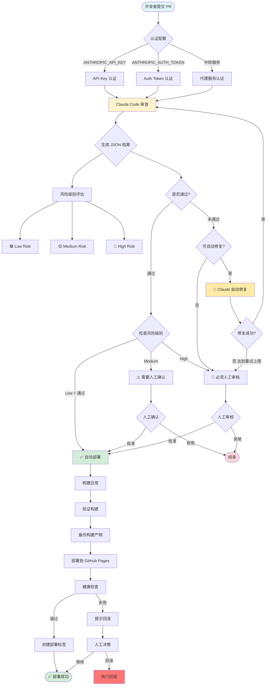
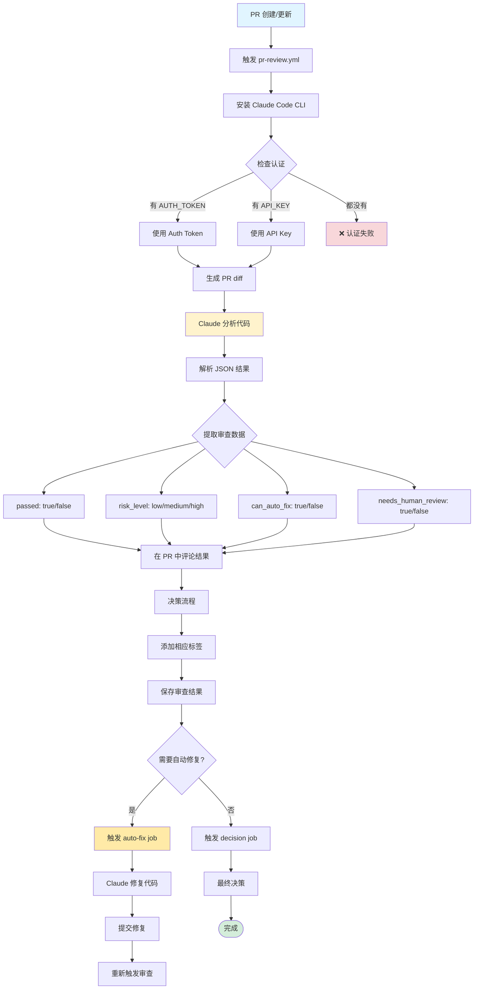
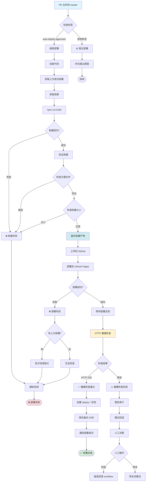
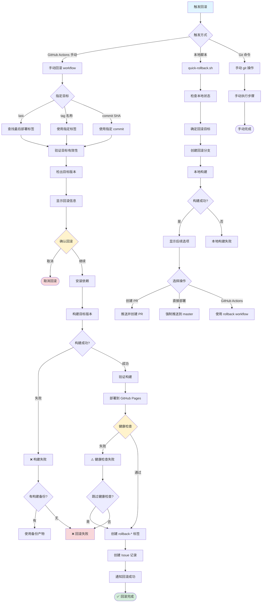
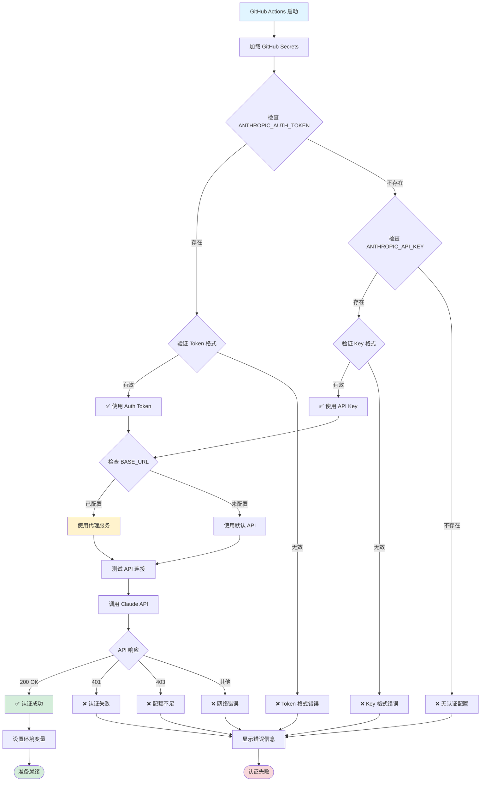
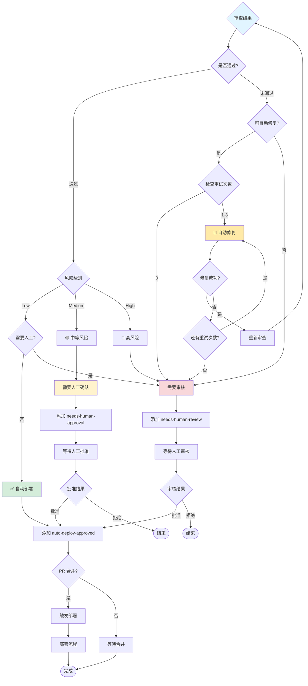
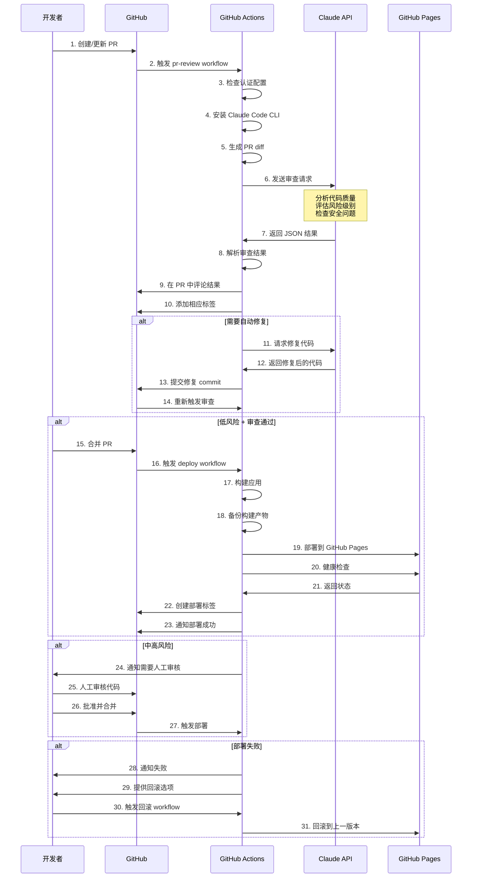

# GitHub + Claude 自动化系统流程图

## 1. 整体架构流程图

## 2. PR 审查流程详细图

## 3. 部署流程详细图

## 4. 回滚流程详细图

## 5. 认证流程图

## 6. 决策树流程图

## 7. 时序图 - PR 完整流程

## 使用说明

以上流程图涵盖了整个自动化系统的：

1. **整体架构** - 系统全貌
2. **PR 审查** - 代码审查详细流程
3. **部署流程** - 从构建到部署的完整步骤
4. **回滚机制** - 三种回滚方式
5. **认证流程** - 双认证支持
6. **决策树** - 自动化决策逻辑
7. **时序图** - 各组件交互时序

可以在支持 Mermaid 的工具中渲染这些图表：
- GitHub README.md
- GitLab
- VS Code (Markdown Preview Mermaid Support 插件)
- Typora
- draw.io
- mermaid.live (在线编辑器)
