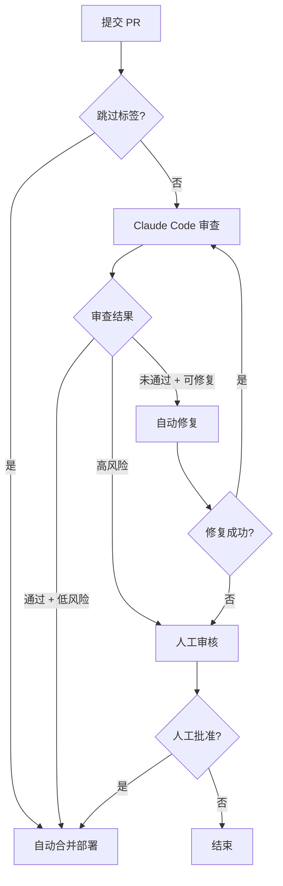

# GitHub + Claude 自动化审查和部署系统

## 🎯 项目目标

实现基于 Claude Code headless 的全自动代码审查和部署流程，在确保代码质量的前提下，最大程度减少人工干预。

## ✨ 核心功能

### 1. 自动代码审查
- ✅ PR 提交后自动触发 Claude Code 审查
- ✅ 返回结构化的 JSON 审查结果
- ✅ 自动评估风险级别（low/medium/high）
- ✅ 在 PR 中自动评论审查报告

### 2. 智能自动修复
- ✅ 识别可自动修复的问题（格式、lint 等）
- ✅ Claude 自动修复代码并提交
- ✅ 支持重试机制（最多 3 次）
- ✅ 修复失败自动转人工审核

### 3. 分级部署决策
- ✅ **低风险 + 审查通过** → 自动部署
- ✅ **中等风险** → 需要人工确认
- ✅ **高风险** → 必须人工审核
- ✅ 自动添加标签标识状态

### 3b. 跳过审查（可选）
- ✅ PR 标题或标签触发跳过 Claude 审查
- ✅ 跳过后直接进入自动合并和部署
- ✅ 自动记录跳过原因并评论到 PR
- ⚠️ 仅限文档、样式等低风险变更，详见 [SKIP-REVIEW.md](./SKIP-REVIEW.md)

### 4. 完整的审计追踪
- ✅ 所有审查结果保存为 artifacts（7天）
- ✅ 详细的操作日志
- ✅ 评论记录所有决策过程

### 5. 并发安全
- ✅ 同一 PR 分支的 workflow 排队执行，避免冲突
- ✅ 临时文件使用 PR 编号 + Run ID 唯一命名
- ✅ 自动修复推送前检测远程变更并尝试 rebase

### 6. 部署回滚机制
- ✅ 部署前自动备份
- ✅ 构建和健康检查验证
- ✅ 失败自动提示回滚
- ✅ 支持手动回滚到任意版本
- ✅ 本地快速回滚工具

## 📁 文件结构

```
.github/
├── workflows/
│   ├── pr-review.yml          # PR 自动审查流程
│   ├── deploy.yml             # 自动部署流程（含回滚保护）
│   ├── rollback.yml           # 手动回滚流程
│   └── test-secrets.yml       # API 配置测试
├── scripts/
│   ├── claude-review.sh       # Claude 审查脚本
│   ├── claude-fix.sh          # Claude 自动修复脚本
│   └── quick-rollback.sh      # 本地快速回滚工具
├── SETUP.md                   # 快速启动指南
├── CONFIG.md                  # 详细配置文档
├── AUTH.md                    # 认证配置指南
├── AUTO-MERGE.md              # 自动合并配置说明
├── SKIP-REVIEW.md             # 跳过审查指南
├── GITHUB-SETUP.md            # GitHub 配置清单
├── ROLLBACK.md                # 回滚操作指南
├── FLOWCHARTS.md              # 系统流程图
└── README.md                  # 本文件
```

## 🚀 快速开始

### 第一步：配置 Secrets

在仓库 Settings → Secrets and variables → Actions 中添加：

```
ANTHROPIC_API_KEY=sk-ant-xxx...          # 必需
ANTHROPIC_BASE_URL=https://your-proxy.com  # 可选（使用中转服务时）
```

### 第二步：设置权限

Settings → Actions → General → Workflow permissions：

- ✅ Read and write permissions
- ✅ Allow GitHub Actions to create and approve pull requests

### 第三步：创建标签

创建以下标签（Issues → Labels）：

- `auto-deploy-approved` - 绿色（审查通过或跳过后自动添加）
- `needs-human-approval` - 黄色  
- `needs-human-review` - 红色
- `review-failed` - 灰色

可选（用于跳过审查，见 [SKIP-REVIEW.md](./SKIP-REVIEW.md)）：

- `skip-claude-review` - 蓝色
- `skip-review` - 蓝色
- `auto-merge-approved` - 蓝色（触发跳过，与 `auto-deploy-approved` 不同）

### 第四步：测试

创建一个测试 PR，观察自动化流程。

**详细步骤请查看** → [SETUP.md](./SETUP.md)

## 📖 工作流程



## 🔍 审查维度

Claude 会从以下维度审查代码：

### 代码质量
- 语法错误和类型问题
- 代码规范和格式
- 命名规范
- 代码复杂度

### 安全性
- SQL 注入风险
- XSS 漏洞
- 认证/授权问题
- 敏感信息泄露

### 最佳实践
- 错误处理
- 资源管理
- 性能优化
- 可维护性

### 测试覆盖
- 新功能是否有测试
- 测试是否充分
- 边界情况是否考虑

## 🎛️ 风险级别

### 🟢 Low（低风险）
- CSS/样式修改
- 文档更新
- 配置调整（非敏感）
- 注释修改

**决策**：审查通过 → 自动部署

### 🟡 Medium（中等风险）
- 非关键路径的逻辑修改
- 有测试的新功能
- 代码重构
- 小版本依赖升级

**决策**：需要人工确认后部署

### 🔴 High（高风险）
- 安全相关代码
- 认证/授权逻辑
- 数据库迁移
- API 破坏性变更
- 大版本依赖升级

**决策**：必须人工详细审核

## 💡 能否实现 0 人工部署？

### ✅ 可以自动化的场景（约 30-40%）

- 文档更新（README, CHANGELOG）
- CSS/样式调整
- 配置文件微调（非敏感）
- 格式化和 lint 修复
- 依赖版本锁定文件更新
- 简单的 UI 文本修改

### ⚠️ 需要人工确认的场景（约 40-50%）

- 新功能实现（有完整测试）
- 代码重构
- 非关键组件修改
- 小版本依赖升级

### 🔴 必须人工介入的场景（约 10-20%）

- 安全敏感代码
- 架构级别变更
- 数据库模式修改
- 外部服务集成
- 复杂业务逻辑

### 结论

**技术上可行**，但建议：

1. **渐进式采用**：从审查开始，逐步开放自动部署
2. **保留人工门槛**：关键路径始终需要人工审核
3. **完善测试**：自动化程度取决于测试覆盖率
4. **持续监控**：定期回顾自动决策的准确性

## 📊 预期效果

| 指标 | 预期值 |
|------|--------|
| 自动审查覆盖率 | 60-70% |
| 自动部署比例 | 30-40% |
| 审查时间节省 | 50%+ |
| 格式问题减少 | 80%+ |
| 平均 PR 处理时间 | 减少 40% |

## 🛡️ 安全保障

### 多重防护

1. **Claude 审查**：第一道防线
2. **自动化测试**：单元测试 + 集成测试
3. **Lint 检查**：代码规范验证
4. **人工审核**：高风险变更必须人工审核
5. **回滚机制**：部署失败可快速回滚

### 审计追踪

- 所有审查结果保存 7 天
- 完整的 git 提交历史
- GitHub Actions 日志
- PR 评论记录

### 失败回退

任何自动化环节失败都会：
1. 立即停止流程
2. 添加警告标签
3. 通知相关人员
4. 等待人工介入

## 🔧 自定义配置

### 调整风险阈值

编辑 `.github/scripts/claude-review.sh`，修改 prompt 中的风险判断标准。

### 修改自动修复策略

编辑 `.github/scripts/claude-fix.sh`，调整：
- 最大重试次数
- 修复范围
- 验证策略

### 定制部署条件

编辑 `.github/workflows/deploy.yml`，修改：
- 触发条件
- 部署环境
- 通知方式

## 📚 文档

- [SETUP.md](./SETUP.md) - 快速启动指南
- [CONFIG.md](./CONFIG.md) - 详细配置文档
- [AUTH.md](./AUTH.md) - 认证配置指南
- [AUTO-MERGE.md](./AUTO-MERGE.md) - 自动合并配置说明
- [SKIP-REVIEW.md](./SKIP-REVIEW.md) - 跳过审查指南
- [GITHUB-SETUP.md](./GITHUB-SETUP.md) - GitHub 配置清单
- [ROLLBACK.md](./ROLLBACK.md) - 回滚操作指南
- [FLOWCHARTS.md](./FLOWCHARTS.md) - 系统流程图

## ⚠️ 注意事项

### API 成本

- 每次审查约消耗 5k-20k tokens
- 预估成本：~$13.5/月（10 PR/天）
- 建议设置 diff 大小限制

### 依赖要求

- Node.js 22+
- Claude Code CLI
- GitHub Actions
- git 2.0+

### 限制

- 超大 PR（>1000行）建议人工审查
- 复杂重构不适合自动修复
- 架构变更需要深度人工审核

## 🐛 故障排查

### Claude API 调用失败

```bash
# 检查 API Key
echo $ANTHROPIC_API_KEY

# 测试连接
curl -H "x-api-key: $ANTHROPIC_API_KEY" \
     $ANTHROPIC_BASE_URL/v1/messages
```

### JSON 解析错误

查看原始输出（`PR_NUMBER` 和 `RUN_ID` 替换为实际值）：
```bash
TMP_PREFIX="/tmp/pr-${PR_NUMBER}-${RUN_ID}"
cat ${TMP_PREFIX}-claude-review-raw.txt
cat ${TMP_PREFIX}-claude-review.log
```

### 部署未触发

检查 PR 标签和 workflow 日志。

**更多问题** → [CONFIG.md](./CONFIG.md) 的故障排查章节

## 🚀 后续优化

- [ ] 智能学习：根据历史优化判断
- [ ] 多模型协作：Haiku 初筛 + Sonnet 详审
- [ ] 测试生成：自动为新功能生成测试
- [ ] 性能分析：自动检测性能回归
- [ ] A/B 测试：自动部署到 staging 验证

## 📞 支持

有问题或建议？

1. 查看文档：[SETUP.md](./SETUP.md) | [CONFIG.md](./CONFIG.md)
2. 提交 Issue
3. 联系团队

---

**License**: MIT  
**Powered by**: Claude Code + GitHub Actions
