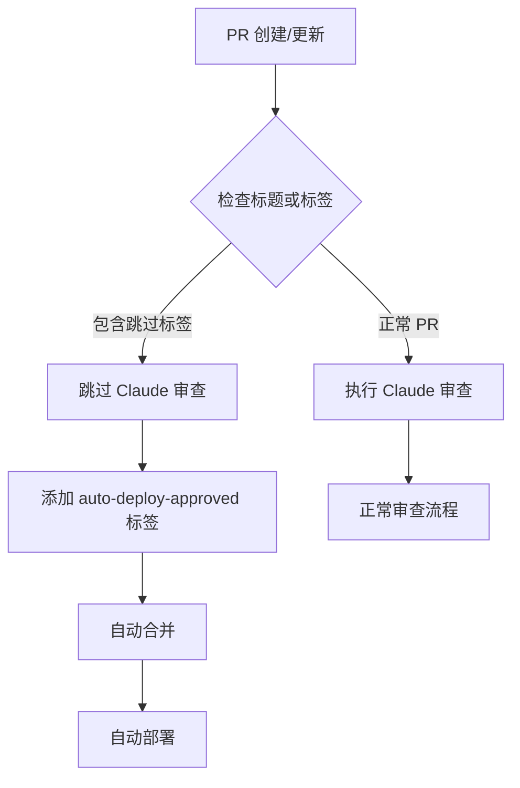

# 跳过 Claude 审查指南

## 📋 功能说明

允许通过特定的标签跳过 Claude AI 自动审查，直接进入自动合并和部署流程。

**⚠️ 警告**: 跳过审查意味着绕过自动代码质量检查，请谨慎使用！

---

## 🎯 使用方法

### 方法 1：PR 标题标签

在创建 PR 时，在标题中添加以下任一标签：

```
[skip-review] docs: update README
[deploy-direct] style: fix button color  
[trusted] chore: update dependencies
```

**支持的标题标签**：
- `[skip-review]` - 跳过审查
- `[deploy-direct]` - 跳过审查并直接部署
- `[trusted]` - 受信任的提交

### 方法 2：PR 标签

在 GitHub PR 页面右侧添加以下任一标签：

- `skip-claude-review`
- `skip-review`
- `auto-merge-approved`（触发跳过，与决策输出的 `auto-deploy-approved` 不同）

---

## 🔄 工作流程



**跳过审查后的流程**：
1. ✅ 系统检测到跳过标签
2. ✅ 在 PR 中添加说明评论
3. ✅ 添加 `auto-deploy-approved` 标签
4. ✅ 自动合并 PR
5. ✅ 触发自动部署

---

## ✅ 适用场景

建议在以下场景使用跳过审查：

### 🟢 安全场景（推荐）

- **文档更新**
  ```
  [skip-review] docs: update API documentation
  [skip-review] docs: fix typo in README
  ```

- **样式调整**
  ```
  [skip-review] style: adjust button padding
  [skip-review] style: update CSS colors
  ```

- **配置文件**
  ```
  [skip-review] chore: update .gitignore
  [skip-review] config: adjust ESLint rules
  ```

- **依赖锁文件**
  ```
  [skip-review] chore: update package-lock.json
  ```

### 🟡 谨慎使用场景

- 紧急热修复（已经过人工审查）
- 回滚操作
- 简单的文本修改

---

## ❌ 禁止使用场景

**以下场景严禁跳过审查**：

- ❌ 代码逻辑变更
- ❌ 新功能实现
- ❌ Bug 修复（涉及逻辑）
- ❌ 安全相关代码
- ❌ API 变更
- ❌ 数据库迁移
- ❌ 认证/授权逻辑
- ❌ 依赖大版本升级

---

## 📝 示例

### ✅ 正确使用

```bash
# 文档更新
git commit -m "docs: add deployment guide"
git push origin feature/docs
# PR 标题: [skip-review] docs: add deployment guide
```

```bash
# 样式调整
git commit -m "style: fix header alignment"
git push origin fix/header-style
# PR 标题: [deploy-direct] style: fix header alignment
```

### ❌ 错误使用

```bash
# 功能实现 - 不应跳过审查！
git commit -m "feat: add user authentication"
# PR 标题: [skip-review] feat: add user authentication  ❌
```

```bash
# Bug 修复 - 不应跳过审查！
git commit -m "fix: resolve SQL injection vulnerability"
# PR 标题: [skip-review] fix: resolve SQL injection  ❌
```

---

## 🛡️ 安全措施

### 自动记录

系统会在 PR 中自动添加评论，记录跳过原因：

```markdown
## ⏭️ 跳过 Claude 审查

**原因**: PR 标题包含跳过标签: [skip-review]

**注意**: 此 PR 已跳过自动代码审查，请确保：
- ✅ 代码已经过人工审查
- ✅ 测试已通过
- ✅ 变更风险可控

此 PR 将直接进入自动合并流程。
```

### 审计追踪

所有跳过审查的操作都会被记录：
- PR 评论中的跳过说明
- `auto-deploy-approved` 标签
- Git 提交历史
- GitHub Actions 日志

### 建议配置

如需进一步限制，可以配置：

1. **分支保护规则**
   - 要求至少 1 人批准
   - 即使跳过审查也需要人工批准

2. **CODEOWNERS**
   - 关键文件必须特定人员审核
   - 即使有跳过标签也需要 review

---

## 🔍 检查是否生效

### 检查 PR 评论

如果跳过成功，会看到：
```
⏭️ 跳过 Claude 审查
原因: PR 标题包含跳过标签: [skip-review]
```

### 检查 PR 标签

应该看到 `auto-deploy-approved` 标签被自动添加。

### 检查 Actions 日志

在 GitHub Actions 中可以看到：
- `check-skip-review` job 显示 "Should skip: true"
- `claude-review` job 被跳过
- `decision` job 直接批准自动部署

---

## 📊 统计和监控

### 建议监控指标

定期检查跳过审查的使用情况：

```bash
# 查看最近的跳过审查 PR
gh pr list --label "auto-deploy-approved" --state closed --limit 20

# 统计跳过次数
gh pr list --label "auto-deploy-approved" --state all --json number | jq 'length'
```

### 使用建议

- **目标比例**: 跳过审查的 PR < 20%
- **定期审计**: 每月检查跳过审查的 PR
- **团队规范**: 制定清晰的使用指南

---

## ⚠️ 注意事项

### 1. 责任归属

跳过审查意味着：
- 提交者对代码质量负全责
- 需要确保代码已经过充分测试
- 出现问题需要立即回滚

### 2. 紧急使用

紧急情况下使用跳过审查：
1. 立即在团队群通知
2. 说明跳过原因
3. 部署后进行补充审查
4. 记录在团队文档中

### 3. 滥用处理

如果发现滥用跳过审查功能：
1. 团队内部讨论
2. 可能需要增加权限限制
3. 考虑要求人工批准

---

## 🔧 自定义配置

### 修改支持的标签

编辑 `.github/workflows/pr-review.yml`:

```javascript
// PR 标题标签
const titleTags = ['[skip-review]', '[deploy-direct]', '[trusted]', '[your-tag]'];

// PR 标签
const skipLabels = ['skip-claude-review', 'skip-review', 'your-label'];
```

### 添加额外验证

可以在 `check-skip-review` job 中添加：
- 文件类型检查
- 提交者权限验证
- 团队成员验证

---

## 📚 相关文档

- [README.md](./README.md) - 系统总览
- [CONFIG.md](./CONFIG.md) - 详细配置
- [AUTO-MERGE.md](./AUTO-MERGE.md) - 自动合并配置
- [GITHUB-SETUP.md](./GITHUB-SETUP.md) - GitHub 配置清单

---

## 🆘 常见问题

### Q: 添加了标签但还是执行了审查？

**A**: 检查标签拼写，确保使用正确的格式：
- 标题标签需要包含方括号：`[skip-review]`
- PR 标签不需要方括号：`skip-review`

### Q: 可以跳过审查但不自动合并吗？

**A**: 目前跳过审查会自动合并。如需人工合并，不要使用跳过标签。

### Q: 跳过审查后出现问题怎么办？

**A**: 
1. 立即使用回滚功能：运行 `Rollback Deployment` workflow
2. 或创建新的 PR 修复问题
3. 通知相关团队成员

---

**最后更新**: 2026-07-02  
**维护者**: 开发团队
